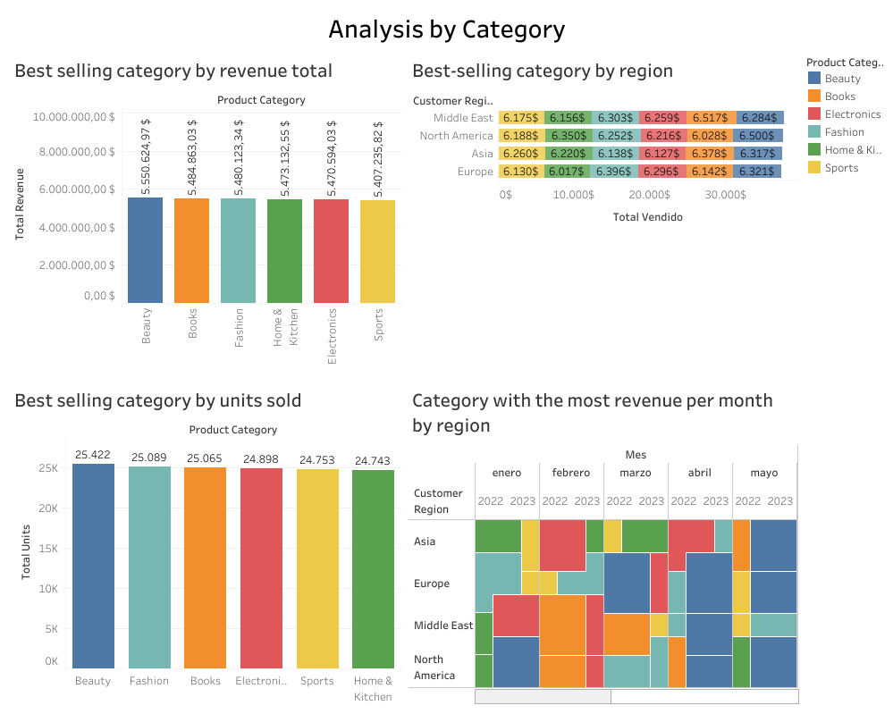
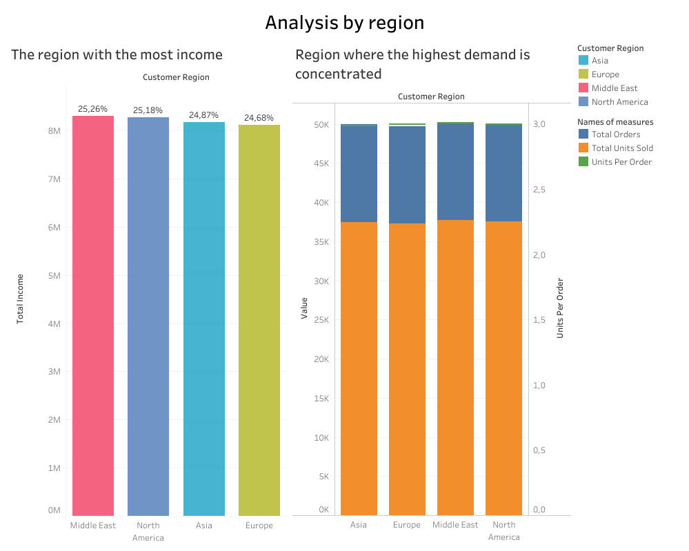
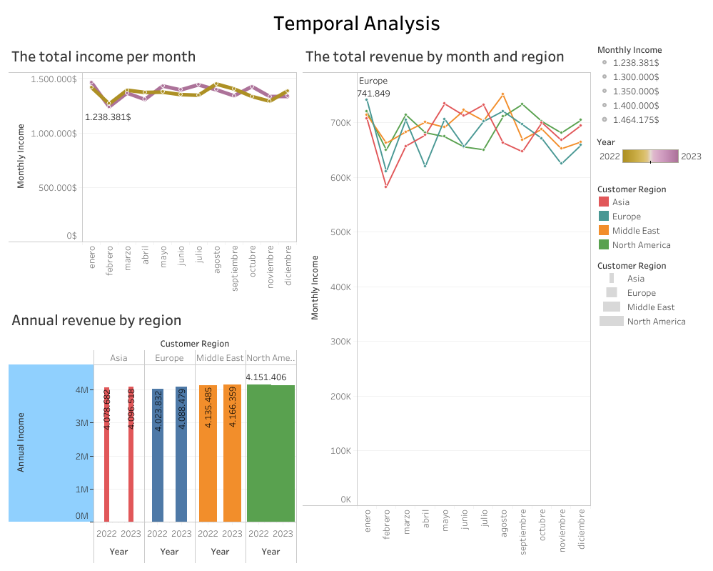
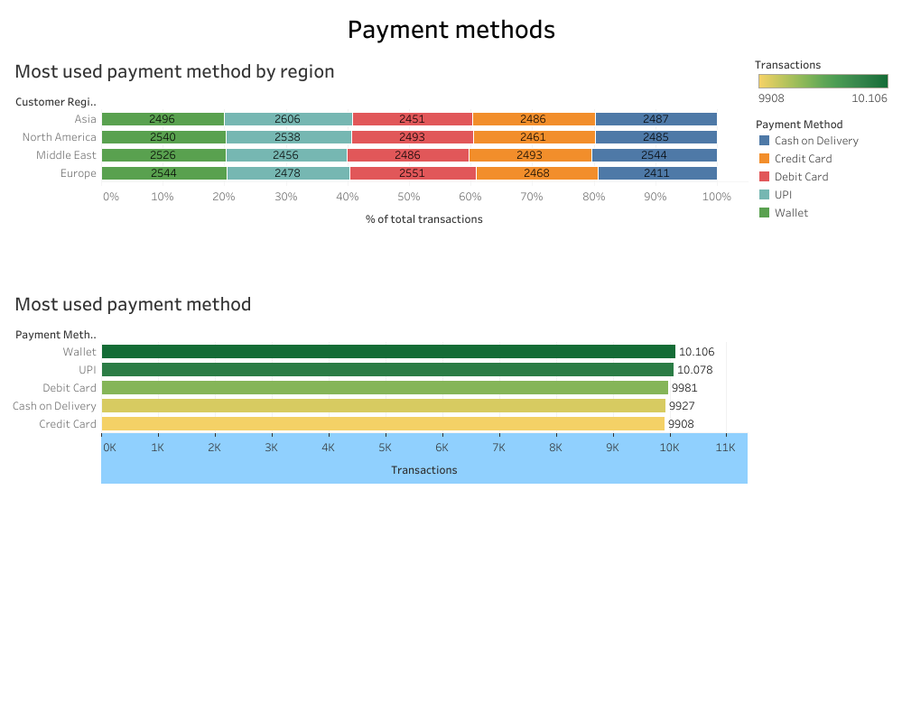
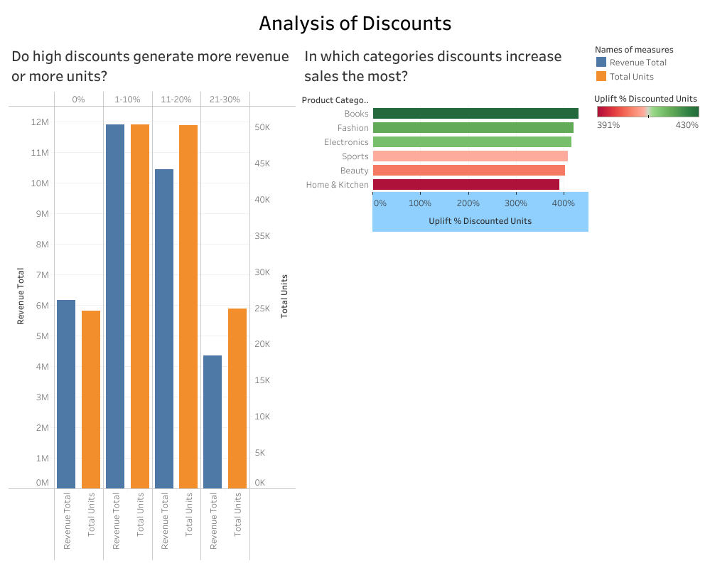

# Exploratory Analysis (SQL)

**Best selling category by total revenue.**

	SELECT 
    	  product_category,
          ROUND(SUM(total_revenue), 2) AS total_revenue,
          ROUND(SUM(total_revenue) / (SELECT SUM(total_revenue) FROM amazon_sales_clean) * 100, 2) AS percentage_of_total
       FROM amazon_sales_clean
       GROUP BY product_category
       ORDER BY total_revenue DESC;

| Product Category   | Total Revenue    | % of Total |
|--------------------|------------------|-------------|
| Beauty             | $5,559,624.97    | 18.4%       |
| Books              | $5,481,137.48    | 18.1%       |
| Electronics        | $5,400,123.74    | 17.9%       |
| Fashion            | $5,300,000.00    | 17.6%       |
| Home & Kitchen     | $5,200,000.00    | 17.2%       |
| Sports             | $4,978,738.81    | 16.5%       |

**Best selling category by units sold**

	SELECT 
          product_category,
          SUM(quantity_sold) AS total_units,
          ROUND(SUM(quantity_sold) / (SELECT SUM(quantity_sold) FROM amazon_sales_clean) * 100, 2) AS percentage_of_total
        FROM amazon_sales_clean
        GROUP BY product_category
        ORDER BY total_units DESC;

| Product Category   | Total Units      | % of Total  |
|--------------------|------------------|-------------|
| Beauty             | 25422            | 16.95%      |
| Fashion            | 25089            | 16.73%      |
| Books              | 25065            | 16.71%      |
| Electronics        | 24898            | 16.60%      |
| Sports             | 24753            | 16.51%      |
| Home & Kitchen     | 24743            | 16.50%      |

**Best-selling category by region**

    SELECT
       product_category,
       customer_region,
       SUM(quantity_sold) AS total_sold
   FROM amazon_sales_clean
   GROUP BY product_category, customer_region
   ORDER BY total_vendido;

| Product Category | Customer Region | Total Sold |
| ---------------- | --------------- | ---------- |
| Books            | Middle East     | 6,517      |
| Beauty           | North America   | 6,500      |
| Fashion          | Europe          | 6,396      |
| Books            | Asia            | 6,378      |
|Home & Kitchen    | North America   | 6,350      |
| …                | ...             | ...        |

**Note:** This table represents a sample of the full dataset, which includes 24 unique category-region combinations.

**Category with the most revenue per month by region**

  WITH ranked AS (
	SELECT 
		product_category,
		customer_region, 
        DATE_FORMAT(order_date, '%Y-%m') AS month,
        ROUND(SUM(total_revenue), 2) AS revenue,
        ROW_NUMBER() OVER (
            PARTITION BY customer_region, DATE_FORMAT(order_date, '%Y-%m')
            ORDER BY SUM(total_revenue) DESC
        ) AS rn
        FROM amazon_sales_clean
        GROUP BY customer_region, mes,product_category)
  SELECT 
	customer_region,
	month,
	product_category,
	revenue,
	rn AS position
  FROM ranked
  WHERE rn <= 1
  ORDER BY customer_region, month, rn;

| Customer Region | Month   | Product Category | Revenue  | Position |
|---------------- |---------|----------------- | ---------|--------- |
| Asia            | 2022-01 | Home & Kitchen   | 64,356.73| 1        |
| Asia            | 2022-02 | Electronics      | 58,362.75| 1        |
| ...             | ...     | ...              | ...      | ...      |
| Europe          | 2022-01 | Fashion          | 73,477.06| 1        |
| Europe          | 2022-02 | Sports           | 58,514.92| 1        |
| ...             | ...     | ...              | ...      | ...      |
| Middle East     | 2022-01 | Home & Kitchen   | 67,681.37| 1        |
|Middle East      | 2022-02 | Books            | 67,873.66| 1        |
| ...             | ...     | ...              | ...      | ...      |
| North America   | 2022-01 | Home & Kitchen   | 70,200.35| 1        |
| North America   | 2022-02 | Books            | 60,782.59| 1        |

 **Note:** The full report contains monthly rankings for all regions through 2023.

 

**View full interactive dashboard**   [https://public.tableau.com/views/Amazon_sales_17743877294890/Dashboard1?:language=es-ES&:sid=&:redirect=auth&:display_count=n&:origin=viz_share_link] 

### Key Insights
- Beauty leads both in revenue ($5.56M) and in units sold, but the difference with the rest of categories is minimal.
- Sales are very balanced between the 4 regions, with clear local preferences: Books (Middle East), Beauty (North America), Fashion (Europe) and Sports (Asia).
- The monthly leadership is highly rotating → no category dominates the whole year.

## Análisis by region

**The total revenue by year and by region**

  SELECT 
	YEAR(order_date) AS year,
    customer_region,
    ROUND(SUM(total_revenue), 2) AS annual_income,
    COUNT(DISTINCT order_id) AS unic_requests,
    ROUND(SUM(total_revenue) / COUNT(DISTINCT order_id), 2) AS average_ticket
  FROM amazon_sales_clean
  GROUP BY year, customer_region
  ORDER BY year, customer_region;

| year  | customer_region| annual_income| unic_requests |average_ticket|
|-------| -------------  |--------------|---------------|--------------|
|2022   | Asia           | 4078681.65   |6184           | 659.55       |
|2022   | Europe         | 402382.26    |6271           | 647.23       | 
|...    | …              | …            | …             | …            |
|2023   | Asia           | 4096518.18   |6342           | 645.93       |
|2023   | Europe         | 4088479.31   |6235           | 655.73       |

**Note:** The full dataset includes 2022 and 2023 across four key regions.

**In which regions the greatest demand is concentrated**

 SELECT 
	customer_region,
    ROUND(SUM(quantity_sold),0) AS total_units_sold,
    COUNT(DISTINCT order_id) AS total_orders,
    ROUND(SUM(quantity_sold) / COUNT(DISTINCT order_id), 2) AS units_by_order
 FROM amazon_sales_clean
 GROUP BY customer_region
 ORDER BY total_units_sold DESC;

 |customer_region| total_units_sold| total_orders | units_by_order|
 |-------------  |-----------------|--------------|---------------|
 |Middle East    |37694            |12505         |3.01           |
 |North America  |37534            |12517         |3.00           |
 |Asia           |37440            |12526         |2.99           |
 |Europe         |37302            |12452         |3.00           |

  

**View full interactive dashboard**   [https://public.tableau.com/views/Amazon_sales_17743877294890/Dashboard1?:language=es-ES&:sid=&:redirect=auth&:display_count=n&:origin=viz_share_link] 

### Key Insights

-The revenues are distributed almost identically among the four regions, demonstrating a perfect balance and a low geographical dependence.  

-The volume of orders and the ratio of units per order remain stable in all regions, which indicates a globally optimized logistics.

**The total revenue by month and region**
  
  SELECT 
     DATE_FORMAT(order_date, '%Y-%M') AS month,
     customer_region,
     ROUND(SUM(total_revenue), 2) AS income_monthly
  FROM amazon_sales_clean
  GROUP BY month, customer_region
  ORDER BY month, customer_region;

| Year | Month    | Region        |     Value  |
|----- |----------|---------------| ---------- |
| 2022 | January  | Asia          | 355,294.67 |
| 2022 | January  | Europe        | 365,360.20 |
| 2022 | February | Middle East   | 333,349.79 |
| 2022 | February | North America | 334,138.52 |
| ...  | ...      | ...           | ...        |
| 2023 | January  | Asia          | 352,499.00 |
| 2023 | January  | Europe        | 376,488.87 |
| 2023 | February | Middle East   | 329,108.22 |
| 2023 | February | North America | 315,898.65 |

**Note:** The full dataset includes all months for 2022 and 2023 across four key regions.

**The total income per year**

  SELECT 
    YEAR(order_date) AS year,
    ROUND(SUM(total_revenue), 2) AS annual_income,
    COUNT(DISTINCT order_id) AS orders_unique,
    ROUND(SUM(total_revenue) / COUNT(DISTINCT order_id), 2) AS average_ticket
 FROM amazon_sales_clean
 GROUP BY year
 ORDER BY year;

|year | annual_income | orders_unique |average_ticket|
|-----|-------------- |---------------|--------------|
|2022 | 16,389,404.56 | 24,926        | 657.52       |
|2023 | 16,477,169.18 | 25,074        | 657.14       |

**The total revenue by year and by region**

  SELECT 
      YEAR(order_date) AS year,
      customer_region,
      ROUND(SUM(total_revenue), 2) AS annual_income,
      COUNT(DISTINCT order_id) AS orders_unique,
      ROUND(SUM(total_revenue) / COUNT(DISTINCT order_id), 2) AS average_ticket
  FROM amazon_sales_clean
  GROUP BY year, customer_region
  ORDER BY year, customer_region;

| Year | Region          | Annual Revenue   | Unique Orders | Avg. Ticket |
|------|-----------------|------------------|---------------|-------------|
| 2022 | Asia            | $4,078,681.65    | 6,184         | $659.55     |
| 2022 | Europe          | $4,023,832.26    | 6,217         | $647.23     |
| 2022 | Middle East     | $4,135,485.02    | 6,255         | $661.15     |
| 2022 | North America   | $4,151,405.63    | 6,270         | $662.11     |
| 2023 | Asia            | $4,096,518.18    | 6,342         | $645.93     |
| 2023 | Europe          | $4,088,479.31    | 6,235         | $655.73     |
| 2023 | Middle East     | $4,166,359.48    | 6,250         | $666.62     |
| 2023 | North America   | $4,125,812.21    | 6,247         | $660.45     |

 

**View full interactive dashboard**   [https://public.tableau.com/views/Amazon_sales_17743877294890/Dashboard1?:language=es-ES&:sid=&:redirect=auth&:display_count=n&:origin=viz_share_link] 

**Key Observations:**
- Monthly revenue charts reveal a clear inflection point in February(both 2022 and 2023), followed by a strong recovery in March.
- Although annual revenue bars show a slightly higher total in 2023, the monthly revenue lines are almost completely overlapping. In several months (especially May–June, August, and October), 2022 actually outperformed 2023.
- This suggests that seasonal campaigns in 2023 were less effective than those in the previous year.

**Regional Behavior:**
- Asia shows the most aggressive drop in February, indicating high sensitivity to cultural or seasonal factors that temporarily halt consumption.
- Middle East is the most stable region, acting as a natural buffer with more consistent revenue and fewer sharp declines.
- Europe and North America move in tandem, experiencing deep drops in June–July (especially in 2022) and sharing revenue peaks in September — likely linked to the back-to-school / start of the work cycle.

The most used payment method

  SELECT 
     DISTINCT payment_method,
     COUNT(payment_method) AS transactions
  FROM amazon_sales_clean
  GROUP BY payment_method
  ORDER BY type_payment DESC;

| payment_method     | transactions |
|--------------------|--------------|
| Wallet             | 10,106       |
| UPI                | 10,078       |
| Debit Card         | 9,981        |
| Cash on Delivery   | 9,927        |
| Credit Card        | 9,908        |

**The most used payment method by region**

  SELECT 
    DISTINCT payment_method,
    customer_region,
    COUNT(payment_method) AS transactions
  FROM amazon_sales_clean
  GROUP BY payment_method, customer_region
 ORDER BY transactions DESC;

| payment_method     | customer_region | transactions |
|--------------------|-----------------|--------------|
| UPI                | Asia            | 2,606        |
| Debit Card         | Europe          | 2,551        |
| Cash on Delivery   | Middle East     | 2,544        |
| Wallet             | Europe          | 2,544        |
| Wallet             | North America   | 2,540        |
| UPI                | North America   | 2,538        |
| Wallet             | Middle East     | 2,526        |
| Wallet             | Asia            | 2,496        |

 
 
**View full interactive dashboard**   [https://public.tableau.com/views/Amazon_sales_17743877294890/Dashboard1?:language=es-ES&:sid=&:redirect=auth&:display_count=n&:origin=viz_share_link] 

**Most Used Payment Method**  
Walletis the most popular payment method with 10,106 transactions.  

However, the difference between the most used method (Wallet) and the least used (Credit Card) is only 198 transactions. This small gap indicates that the payment infrastructure is well-integrated and equally prepared to accept any payment method.

**Regional Preferences**  
- Asia: UPI is the dominant method  
- Europe: Wallet and Debit Card show the highest volume  
- North America: Wallet leads clearly  
- Middle East: Cash on Delivery is the most preferred

**Do high discounts generate more revenue or more units?**

  SELECT 
	CASE
	  WHEN discount_percent = 0 THEN '0%'
          WHEN discount_percent <= 10 THEN '1-10%'
          WHEN discount_percent <= 20 THEN '11-20%'
          WHEN discount_percent <= 30 THEN '21-30%'
          WHEN discount_percent <= 40 THEN '31-40%'
          WHEN discount_percent <= 50 THEN '41-50%'
          ELSE '51% o more'
       END AS range_discount,
	COUNT(*) AS number_of_transactions,
        ROUND(AVG(discount_percent), 2) AS discount_aveger,
        ROUND(SUM(total_revenue),2) AS revenue_total,
        ROUND(SUM(total_revenue) / (SELECT SUM(total_revenue) FROM amazon_sales_clean) * 100, 1) AS porc_revenue_total,
        SUM(quantity_sold) AS total_units,
        ROUND(SUM(quantity_sold) / (SELECT SUM(quantity_sold) FROM amazon_sales_clean) * 100, 1) AS porc_unit_total,
        ROUND(AVG(total_revenue / NULLIF(quantity_sold, 0)), 2) AS revenue_por_unidad_promedio,
        ROUND(AVG(discounted_price), 2) AS aveger_price
  FROM amazon_sales_clean
  GROUP BY 
    CASE 
        WHEN discount_percent = 0 THEN '0%'
        WHEN discount_percent <= 10 THEN '1-10%'
        WHEN discount_percent <= 20 THEN '11-20%'
        WHEN discount_percent <= 30 THEN '21-30%'
        WHEN discount_percent <= 40 THEN '31-40%'
        WHEN discount_percent <= 50 THEN '41-50%'
        ELSE '51% o more'
    END
  ORDER BY MIN(discount_percent);

| Discount Range| Transactions| Avg. Discount| Total Revenue| % Total Revenue | Units Sold | % Total Units| Avg. Rev/Unit|
| ------------- | ----------- | ------------ | ------------ | --------------- | ---------- | ------------ | ------------ |
| 0%            | 8,216       | 0.00%        | 6,154,055.31 | 18.7%           | 24,537     | 16.4%        | 249.71       |
| 1-10%         | 16,796      | 7.47%        | 11,915,238.37| 36.3%           | 50,349     | 33.6%        | 236.46       |
| 11-20%        | 16,654      | 17.51%       | 10,450,629.14| 31.8%           | 50,230     | 33.5%        |207.92        |
| 21-30%        | 8,334       | 30.00%       | 4,346,650.92 | 13.2%           | 24,854     | 16.6%        | 174.99       |

**In which categories do discounts increase sales the most?**
 
   WITH summary AS(
   SELECT 
      product_category,
      AVG(discount_percent) AS aveger_discount,
      SUM(CASE WHEN discount_percent = 0 THEN quantity_sold ELSE 0 END) AS units_without_discount,
      SUM(CASE WHEN discount_percent > 0 THEN quantity_sold ELSE 0 END) AS units_with_discount,
      SUM(quantity_sold) AS total_units
   FROM amazon_sales_clean
   GROUP BY product_category
   HAVING total_units > 100
   )
  SELECT
      product_category,
      aveger_discount,
      units_without_discount,
      units_with_discount,
      ROUND(
		CASE WHEN units_without_discount > 0
			THEN (units_with_discount/units_without_discount -1)*100
			ELSE NULL
		END, 1
        ) AS uplift_porcentual_unidades_con_descuento
   FROM summary
   ORDER BY uplift_porcentual_unidades_con_descuento DESC;

| Product Category | Avg. Discount | Units (No Discount) | Units (With Discount) | Unit Uplift (%) |
| ---------------- | ------------- | ------------------- | --------------------- | --------------- |
| Books            | 13.34%        | 3,979               | 21,086                | 429.9%          |
| Fashion          | 13.36%        | 4,049               | 21,040                | 419.6%          |
| Electronics      | 13.26%        | 4,040               | 20,858                | 416.3%          |
| Sports           | 13.41%        | 4,067               | 20,686                | 408.6%          |
| Beauty           | 13.37%        | 4,215               | 21,207                | 403.1%          |
| Home & Kitchen   | 13.31%        | 4,187               | 20,556                | 391.0%          |

 

**View full interactive dashboard**   [https://public.tableau.com/views/Amazon_sales_17743877294890/Dashboard1?:language=es-ES&:sid=&:redirect=auth&:display_count=n&:origin=viz_share_link] 

**Most Effective Discount Range**  
Discounts in the 1-10% range generate the highest peak in both Total Revenue (~$12M) and Units Sold (~50K).

When discounts exceed the 21-30% range, total revenue drops sharply (below $5M), even though the volume of units sold remains similar to the level of products with no discount.

**Category Sensitivity to Discounts**
- Books and Fashion are the most sensitive categories — they show the highest increase in sales when discounted.
- Home & Kitchen is the least sensitive — customers buy these products out of necessity rather than opportunity.
